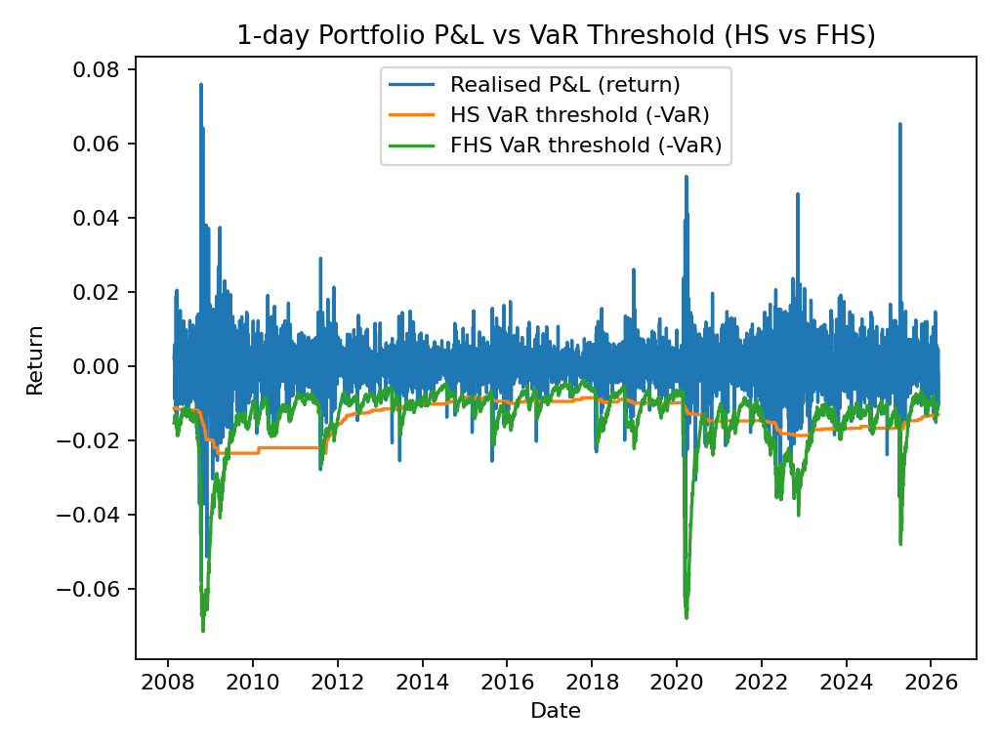
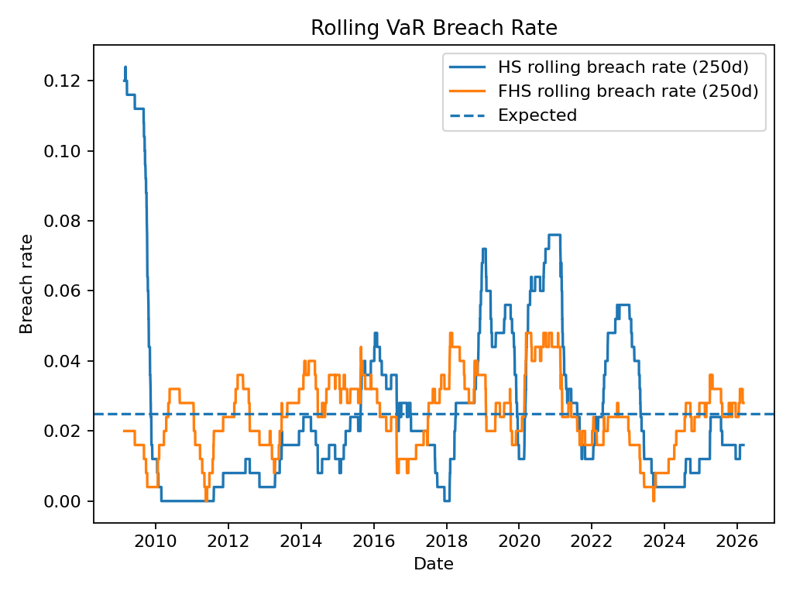

# GARCH Risk Forecasting (VaR/ES) — Filtered Historical Simulation

A reproducible **portfolio risk forecasting** project that compares:

- **HS (Historical Simulation)** VaR/ES  
- **FHS (Filtered Historical Simulation)** VaR/ES using **time-varying volatility** (EWMA / RiskMetrics-style “GARCH-like” volatility)

The goal is a realistic quant workflow: **data → returns → volatility model → Monte Carlo / resampling → VaR backtesting → plots**.

---

## Project structure (high level)

- `src/` — reproducible scripts you run from terminal (`python src/...`)
- `data/` — downloaded datasets (kept out of git except a `.gitkeep`)
- `notebooks/` — optional exploration (not required to reproduce results)
- `reports/` — generated outputs (ignored by git)
- `reports/figures/` — **tracked** key plots embedded in this README

---

## What this project does

- Downloads daily price data (SPY, TLT, GLD) from Stooq (no API key)
- Builds a simple portfolio (60% SPY, 30% TLT, 10% GLD)
- Forecasts **1-day VaR at 97.5%** using:
  - **HS:** quantile of historical returns
  - **FHS:** standardise returns by volatility, resample shocks, scale by next-day volatility
- Walk-forward backtest and produces:
  - Realised P&L vs VaR thresholds
  - Rolling breach rate vs expected breach rate

---

## Results (from a sample run)

Example output:

- **HS breach rate:** ~2.73% (expected 2.50%)
- **FHS breach rate:** ~2.45% (expected 2.50%)

FHS is closer to the expected breach rate because it adapts to volatility clustering.

### Key figures

**Realised P&L vs VaR thresholds**  


**Rolling VaR breach rate**  


---

## Reproduce locally
Or run everything in one go: \python src/run_all.py``
### 1) Create venv + install deps

```bash
python3 -m venv .venv
source .venv/bin/activate
python -m pip install --upgrade pip
pip install -r requirements.txt