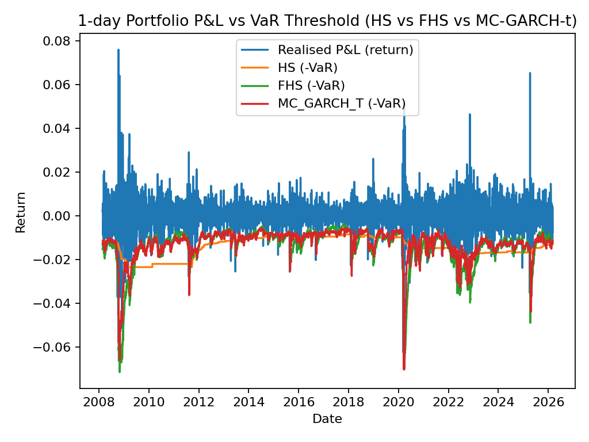
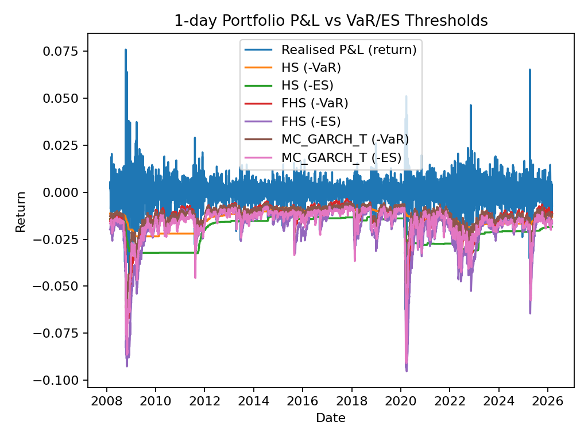
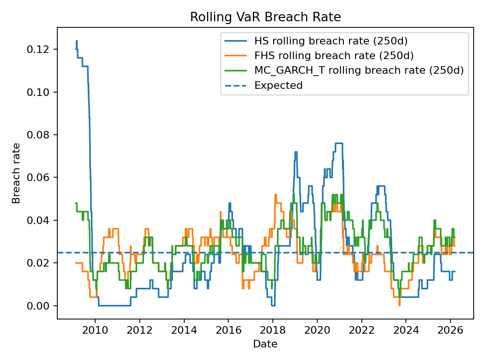

# GARCH Risk Forecasting (VaR/ES) — HS vs FHS vs MC-GARCH-t

A reproducible **portfolio risk forecasting** project that compares:

- **HS (Historical Simulation)** VaR/ES  
- **FHS (Filtered Historical Simulation)** VaR/ES using **time-varying volatility** (EWMA / RiskMetrics-style “GARCH-like” volatility)  
- **MC-GARCH(1,1)-t** VaR/ES using a **Student-t** GARCH model and Monte Carlo simulation

Goal: a realistic quant workflow: **data → returns → volatility model → Monte Carlo / resampling → VaR/ES → backtesting → plots + tables**.

---

## Project structure (high level)

- `src/` — reproducible scripts you run from terminal (`python src/...`)
- `data/` — downloaded datasets (kept out of git except a `.gitkeep`)
- `notebooks/` — optional exploration (not required to reproduce results)
- `reports/` — generated outputs (ignored by git)
- `reports/figures/` — **tracked** key plots embedded in this README
- `reports/tables/` — **tracked** key result tables (CSV)

---

## What this project does

- Downloads daily price data (**SPY, TLT, GLD**) from **Stooq** (no API key)
- Builds a simple portfolio (**60% SPY, 30% TLT, 10% GLD**)
- Forecasts **1-day VaR/ES at 97.5%** using:
  - **HS:** quantile/tail mean of historical returns
  - **FHS:** standardise returns by volatility, resample shocks, scale by next-day volatility
  - **MC-GARCH-t:** fit rolling **GARCH(1,1)** with **Student-t innovations**, simulate next-day distribution
- Walk-forward backtest and produces:
  - Realised P&L vs VaR/ES thresholds
  - Rolling breach rate vs expected breach rate
  - Summary tables + formal VaR backtests

---

## Results (latest run)

Results depend slightly on the latest Stooq data snapshot.

Backtest setup:
- Portfolio: 60% SPY / 30% TLT / 10% GLD
- 1-day risk at **97.5%** confidence (α = 0.975)
- Walk-forward backtest sample size: **~4.5k trading days** (depends on latest Stooq data)
- Expected breach rate: **1 − α = 2.50%**

Empirical calibration (VaR exceptions):
- **HS:** 124 breaches / 4540 → **2.73%**
- **FHS (EWMA):** 113 breaches / 4540 → **2.49%** (closest to expected)
- **MC-GARCH(1,1)-t:** 126 breaches / 4540 → **2.78%**

Average risk levels (return units):
- **Avg VaR:** HS 0.01411 | FHS 0.01418 | MC-GARCH-t 0.01282  
- **Avg ES:**  HS 0.02078 | FHS 0.01915 | MC-GARCH-t 0.01650

Full numeric summaries:
- `reports/tables/backtest_summary.csv`
- `reports/tables/var_backtests.csv`

### VaR backtesting (Kupiec & Christoffersen)

We report likelihood-ratio tests (p-values in `reports/tables/var_backtests.csv`):

- **Kupiec LR_uc (unconditional coverage):** exception rate matches target \(1-\alpha\).
- **Christoffersen LR_ind (independence):** exceptions are independent over time (no clustering).
- **LR_cc (conditional coverage):** joint test (LR_cc = LR_uc + LR_ind).

At the 5% level (**p < 0.05 ⇒ reject**):
- All models pass **unconditional coverage** (p_uc > 0.05).
- All models reject **independence** (p_ind < 0.05), meaning exceptions cluster.
- HS fails **conditional coverage** most strongly; FHS and MC-GARCH-t improve but still reject LR_cc.

## Key figures

Plots compare HS, FHS (EWMA), and MC-GARCH(1,1)-t thresholds against realised 1-day portfolio returns.

**Realised P&L vs VaR thresholds**


**Realised P&L vs VaR and ES thresholds**


**Rolling VaR breach rate**


---

## Reproduce locally

### 1) Create venv + install deps

```bash
python3 -m venv .venv
source .venv/bin/activate
python -m pip install --upgrade pip
pip install -r requirements.txt
```